# ML image classifier for material handling machine

## Overview

The main idea of this project is to implement a pipeline for capturing images from a conveyor, preprocessing them, and passing them to a neural network model which predicts one of three possible states:
- Empty
- Pallet
- Pallet and Block

## Model development

### Image dataset

Before starting the project, I collected and separated an image dataset for these three classes.. This dataset is quite small: 161 Empty, 159 Pallet, 203 Pallet and Block images.

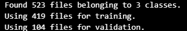

Images were taken on same equipment with variable light setups by illuminating the scene with flashlights or by adding extra shadows. Additionally pallets and blocks were moved randomly within the scene to get more variable images. 

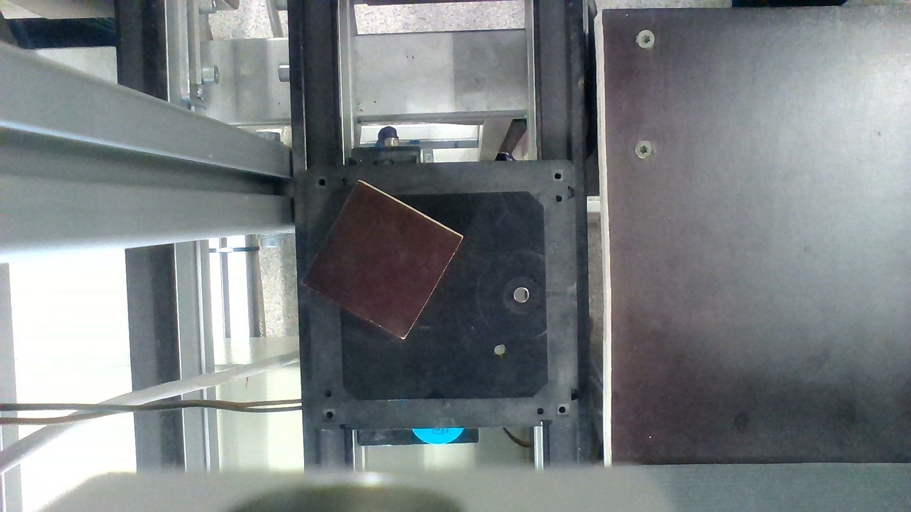

### Technical requirments

This project done in Python 3.10. Full set of required libraries dublicated in requirements.txt:

```text
tensorflow
numpy
opencv-python
```

### Pre-trained model selection

However, my dataset is too small for training a model from scratch. The camera setup and object positioning also limit the use of augmentations such as horizontal flipping and large-angle rotations. For these reasons, I decided to use a pretrained model.

MobileNetV2 was selected because of its small size and low computational requirements, which make it suitable for embedded and edge devices, as well as my previous experience with this architecture.


### Image preprocessing

The initial idea was to crop one-third of the image from each side because the required objects are usually located in the central vertical part of the image.

The input image should also match the model requirements in terms of size and color channels. In this case, the input size is 224×224 pixels with RGB color channels.

```python

batch_size = 32 
target_size = (224,224) # according to the model requirements
label_mode = "int"
color = "rgb" # according to the model requirements
shuffle = True
validation_split = 0.2 # 20% of the data will be used for validation
datapath='./lab_dataset/'

train, validation = tf.keras.preprocessing.image_dataset_from_directory(
    datapath,
    validation_split=validation_split,
    subset="both",
    label_mode=label_mode,
    color_mode=color,
    shuffle=shuffle,
    seed=123,
    image_size=target_size,
    batch_size=batch_size,
    crop_to_aspect_ratio = True,
)
```
Therefore, the images were resized and center-cropped to a 1:1 aspect ratio.

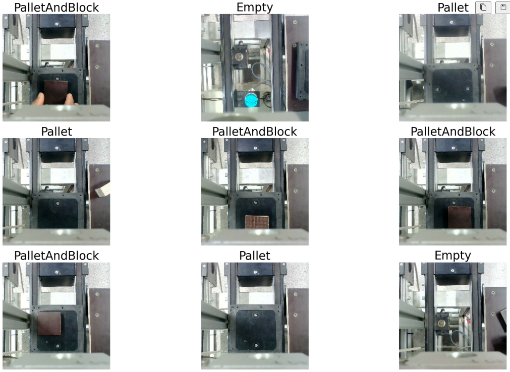


### Pre-trained model prediction  

After passing images through the pretrained model, we get predictions based on model pretrained classes

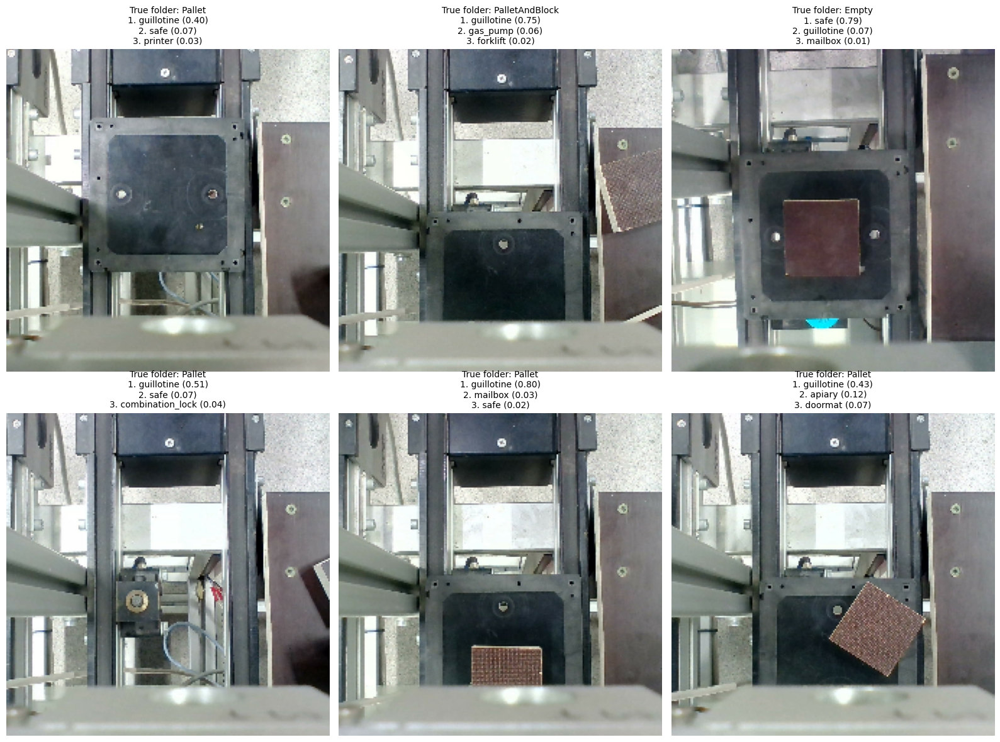

As we can see model does not know our classes out of the box. However, the pretrained model is still able to recognize geometric similarities between objects.
The next step is to teach the model for the target classes.
For this purpose we can a bit expand our dataset by adding random rotation and zoom.
Also I freeze pre-trained layers and setup new layers on top of pre-trained.

```python
data_augmentation = tf.keras.Sequential([
    tf.keras.layers.RandomRotation(0.08), # Rotate images by a random angle between -8% and +8%
    tf.keras.layers.RandomZoom(0.10),  # Zoom images by a random from 0% to 10%
], name='data_augmentation')

base_model = tf.keras.applications.MobileNetV2( # Load the MobileNetV2 model without the top classification layer
    input_shape=target_size + (3,),
    include_top=False,
    weights='imagenet'
)
base_model.trainable = False

model = tf.keras.Sequential([
    tf.keras.layers.Input(shape=target_size + (3,), name='input_layer'),
    data_augmentation,
    tf.keras.layers.Lambda(tf.keras.applications.mobilenet_v2.preprocess_input, name='preprocess_input'),
    base_model,
    tf.keras.layers.GlobalAveragePooling2D(),
    tf.keras.layers.Dropout(0.2),
    tf.keras.layers.Dense(len(train.class_names), activation='softmax')
], name='epb_model') 

model.summary()

```
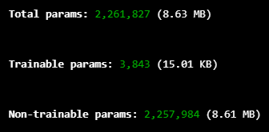

### Compiling and callback 

Adam optimizer with a learning rate of 0.001 was used and callback functions for learning rate reduction and early stopping were added. Then training was started with 20 epochs.

```python
# Compile the model with appropriate loss function, optimizer, and metrics
model.compile(optimizer=tf.keras.optimizers.Adam(learning_rate=1e-3),
              loss=tf.keras.losses.SparseCategoricalCrossentropy(),
              metrics=['accuracy'])

# Callbacks for learning rate reduction
learning_finished = tf.keras.callbacks.ReduceLROnPlateau(
    monitor='val_loss',
    patience=2,
    factor=0.5,
    verbose=1
)

# Callbacks for early stopping
early_stop = tf.keras.callbacks.EarlyStopping(
    min_delta=0.001,
    monitor='val_loss',
    patience=3,
    restore_best_weights=True,
    verbose=1
)

# Train the model
history = model.fit(train,
                    epochs=20,
                    validation_data=validation,
                    callbacks=[early_stop, learning_finished]
                    )

validation_loss, validation_acc = model.evaluate(validation, verbose=2)

print(f'Validation accuracy after transfer learning: {validation_acc:.4f}')
```

Training was stopped on epoch 19 by early stop callback. Accuracy of model as below:

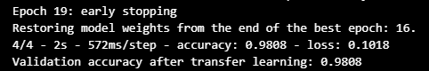

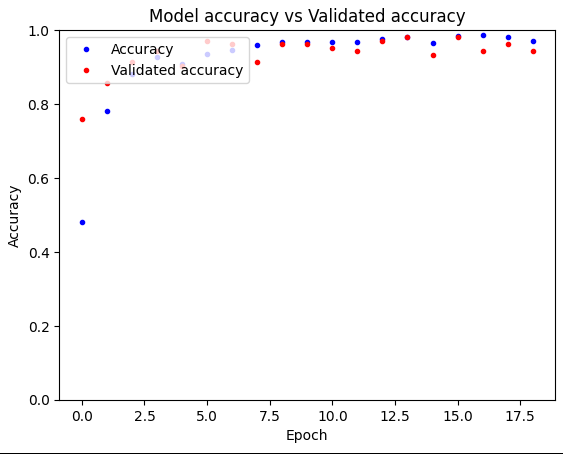

As we can see from plot above, model accuracy significantly improves during few epochs. Both training and validation accuracy improve consistently during training, and a few drops in accuracy occurred but they bring significant improvements in accuracy on next epoches every time.

### Testing on validation dataset

After transfer learning, we can test our model on validation dataset. For better visualisation lets make confusion matrix:


The validation results are sufficiently high to suggest possible overfitting.Some validation results:

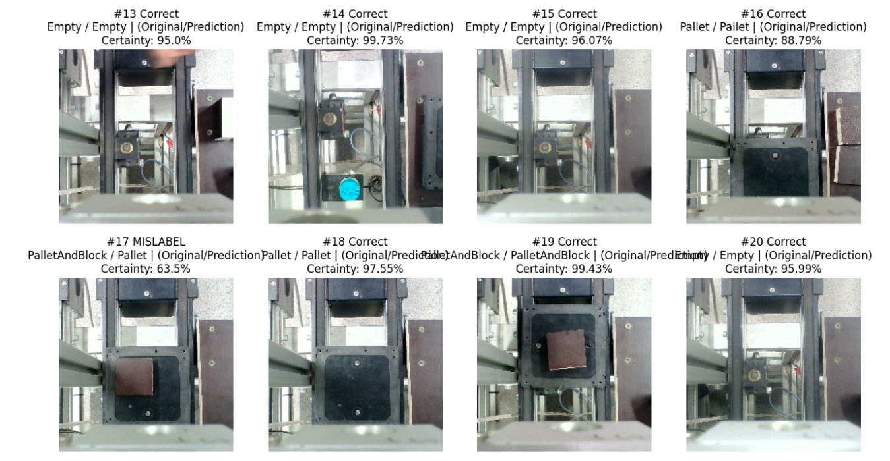

### Fine tuning

Lets unfreeze model and do fine tuning.

```python
base_model.trainable = True 

fine_tune_at = len(base_model.layers) - 20
for layer in base_model.layers[:fine_tune_at]:
    layer.trainable = False

for layer in base_model.layers:
    if isinstance(layer, tf.keras.layers.BatchNormalization):
        layer.trainable = False

model.compile(optimizer=tf.keras.optimizers.Adam(learning_rate=1e-5),
              loss=tf.keras.losses.SparseCategoricalCrossentropy(),
              metrics=['accuracy'])

fine_tune_early_stop = tf.keras.callbacks.EarlyStopping(
    min_delta=0.001,
    monitor='val_loss',
    patience=2,
    restore_best_weights=True,
    verbose=1
)

history_fine = model.fit(train,
                         epochs=len(history.history['loss']) + 4,
                         initial_epoch=len(history.history['loss']),
                         validation_data=validation,
                         callbacks=[fine_tune_early_stop]
                         )

fine_tuned_loss, fine_tuned_acc = model.evaluate(validation, verbose=2)
print(f'Test accuracy after optional fine-tuning: {fine_tuned_acc:.4f}')
print(f'Test loss after optional fine-tuning: {fine_tuned_loss:.4f}')
```


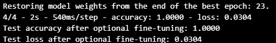

Time to save model and weights for future quick start.

```python
# Save the model
model.save("model_epb_shuba.keras")
# Save the weights
model.save_weights("model_weights.weights.h5")
```


## Pipeline development

For better visualisation of pipeline and sampling images demonstration in live we will use OpenCV.

### Camera testing

To get image flow from camera we will use OpenCV. We can use `VideoCapture` to get frames from camera in separate window.

```python

import cv2

cap = cv2.VideoCapture(0)
# Webcam checkerA
while True:
    ret, frame = cap.read()
    if not ret:
        break

    cv2.imshow("Camera", frame)

    if cv2.waitKey(1) & 0xFF == 27:  # ESC
        break

cap.release()
cv2.destroyAllWindows()
```

### Load model and weights

```python
import numpy as np
import tensorflow as tf
import time

print("Loading model...")
base_model = tf.keras.applications.MobileNetV2(
    input_shape=(224, 224, 3), 
    include_top=False, 
    weights=None # Because we load our weights
)
base_model.trainable = False

model = tf.keras.Sequential([
    base_model,
    tf.keras.layers.GlobalAveragePooling2D(),
    tf.keras.layers.Dense(3, activation='softmax') # 3 Classes
])

# applying weights 
model.load_weights("model_weights.weights.h5")
print("Weights are loaded TF!")
print("Ready!")
```

### Image preprocessing function

We should feed model with same input size and convert image to RGB format as our model expects and was trained on. Lets also display the image after preprocessing.

```python
def predict_frame(frame, model, class_names):
    # 1.  crop_to_aspect_ratio=True
    h, w, _ = frame.shape
    min_side = min(h, w)
    start_x = (w - min_side) // 2
    start_y = (h - min_side) // 2
    frame_cropped = frame[start_y:start_y+min_side, start_x:start_x+min_side]

    # 2. RGB + Resize
    img_rgb = cv2.cvtColor(frame_cropped, cv2.COLOR_BGR2RGB)
    img_resized = cv2.resize(img_rgb, (224, 224))
    
    # 3. preparing array
    img_array = tf.keras.preprocessing.image.img_to_array(img_resized)
    img_array = tf.expand_dims(img_array, 0) # (1, 224, 224, 3)
    img_preprocessed = tf.keras.applications.mobilenet_v2.preprocess_input(img_array)

    # 5. Prediction
    predictions = model.predict(img_preprocessed, verbose=0)
    
    # Get class with highest confidence
    class_id = np.argmax(predictions[0])
    confidence = predictions[0][class_id]
    cv2.imshow("Processed Frame", img_resized)
    return class_names[class_id], confidence

```
Preprocessed output on screen view:

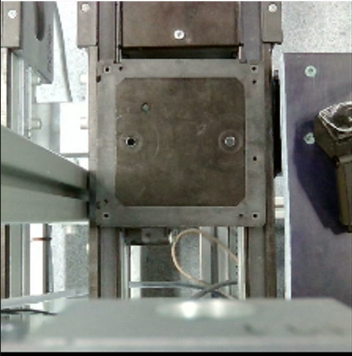


### Main loop

```python
cap = cv2.VideoCapture(0)
last_prediction_time = 0
prediction_interval = 2.0 # sec
current_label = "Waiting..."
current_conf = 0.0

while True:
    ret, frame = cap.read()
    if not ret: break

    current_time = time.time()
    
    # Sampling every 2 sec
    if current_time - last_prediction_time > prediction_interval:
        
        current_label, current_conf = predict_frame(frame, model, train.class_names)
        last_prediction_time = current_time
        print(f"Result: {current_label} ({current_conf:.2%})")

    # Visualisation: Show text on cam image
    text = f"Status: {current_label} ({current_conf:.2%})"
    cv2.putText(frame, text, (10, 30), cv2.FONT_HERSHEY_SIMPLEX, 1, (0, 255, 0), 2)
    
    cv2.imshow("Lab Monitor", frame)

    if cv2.waitKey(1) & 0xFF == 27: break

cap.release()
cv2.destroyAllWindows()
```

## Validation on machine

Our model works well and usually gives high confidence more than 95%. However in some boundary conditions or with extraordinary scenarious it can make mistakes. We need to improve our model by adding more data. 

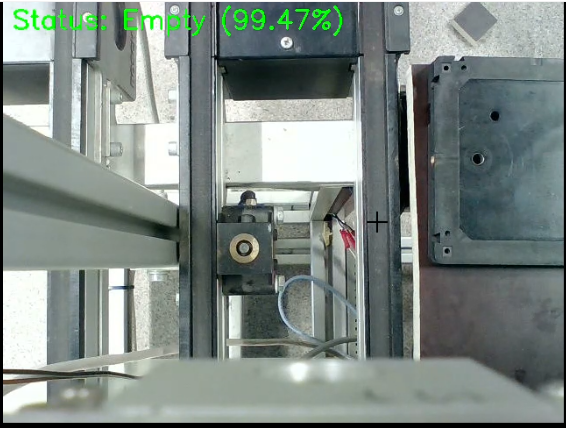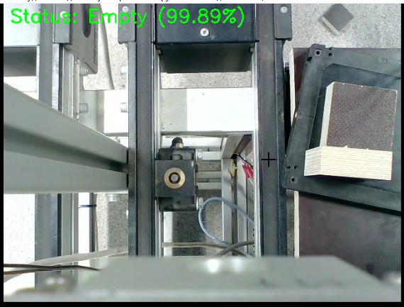

Here we can see that model give correct confidence even pallet and pallet with blocks located nearby to the conveyor.

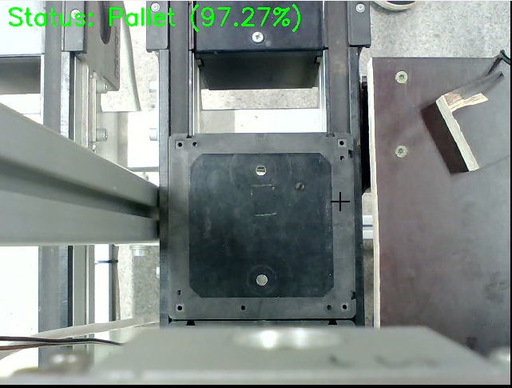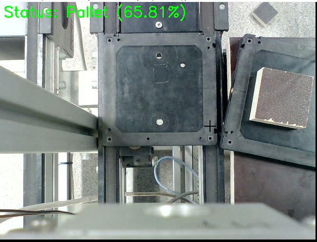

Sometimes our model gives low confidence. But we have extra objects in nearby.

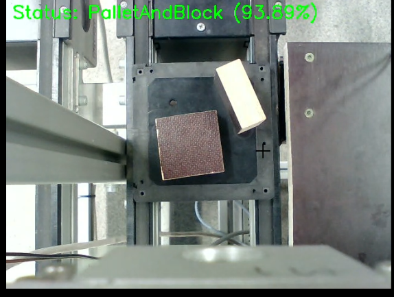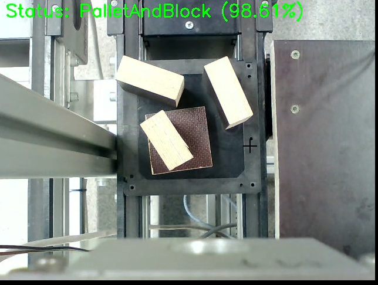

Even multiple blocks can be located on pallet it is still recognized correctly.

Unfortunately, our model is not perfect and some mistakes are still exist. 

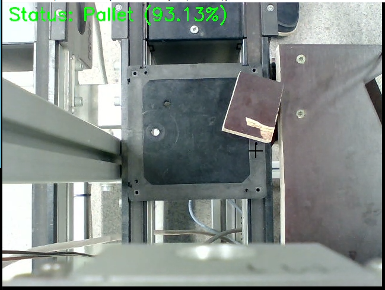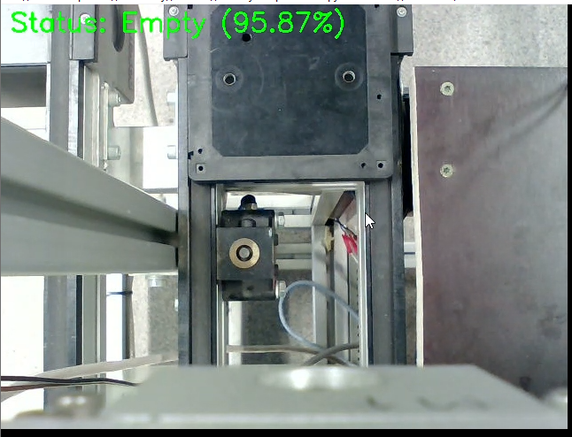

Have to say block on first image untypical and located almost out of pallet.
And on the second pallet is not fully in frame and probably it caused this issue.

## Results and impovment points

### Results

Our pipeline works well and image captured by camera is correctly recognised and classified. Image preprocessing is done correctly and it provides the correct input to the model. Model gives good results for most of the cases. 

Output confidence flacuate in ranges 50%-99.98%, but we can see that model give correct confidence on stable object with quite high average confidence. 
Usually confidence falls down at boundary conditions or in movements. 

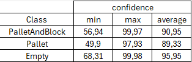

The small model size makes deployment possible on low-power edge devices with limited memory.


### Improvements points

1. Increase dataset size.
2. Improve robustness under varying lighting conditions.
3. Collect additional edge-case samples.
4. Evaluate the model on a larger independent test dataset. 

